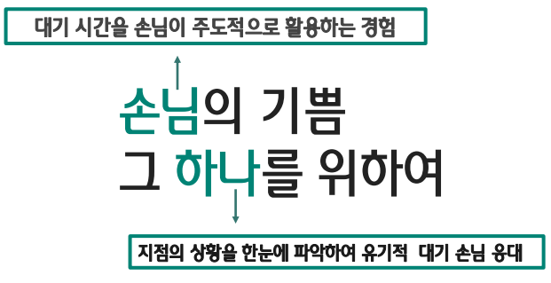

# 디지털 번호표 개선을 통한 방문예약 서비스

[프로젝트 홈페이지 - https://koposoftware.github.io/template/](https://koposoftware.github.io/2020_13_chpark/)

# 1. 프로젝트 개요
 
기존의 하나1Q에서 제공한 대기표 발급 서비스에서 WeakPoint를 개선하여 
손님에게는 더 쉽고 빠른 금융을 
하나에게는 업무 효율 증대를 목적으로 하는 
번호표 발급 서비스 입니다.

# 2. 프로젝트 제안서

   [발표자료](document/proposal.pdf) 
 
# 3. 프로젝트 결과

## 발표 ppt 

   [발표자료](document/finalPt.pdf) 

## 시연 동영상 
   
   <iframe id="ytplayer" type="text/html" width="640" height="360" src="https://www.youtube.com/embed/jsTUPG-s5-E" frameborder="0" allow="accelerometer; autoplay; clipboard-write; encrypted-media; gyroscope; picture-in-picture" allowfullscreen></iframe>
   
# 4. 본인 소개

|이름 |박천호||
|연락처 | cheonho08@naver.com|
|skill set| Frontend - HTML, CSS, Javascript|
| | Backend - Java, Spring, Oracle|

# 5. 기타

   
 
